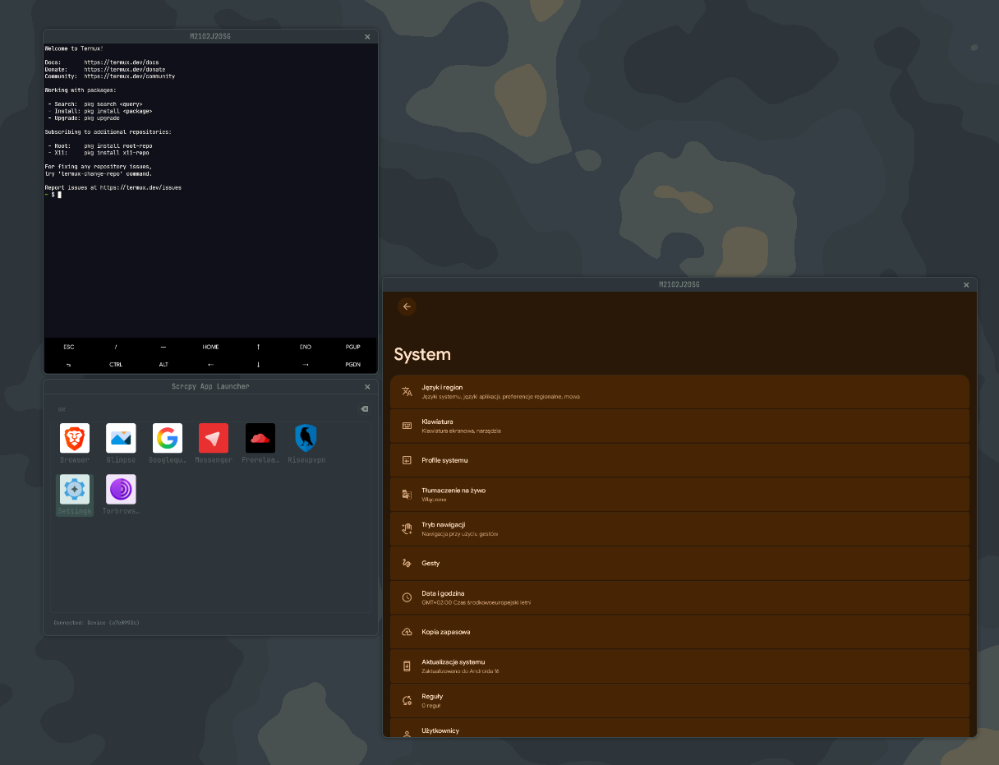
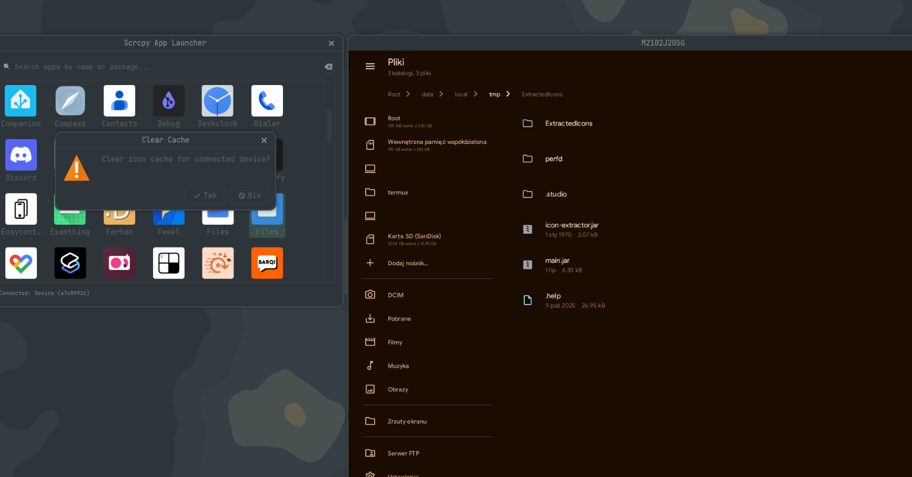

# Scrcpy App Launcher

A small launcher that lists installable Android apps from a connected device and starts them via [`scrcpy`](https://github.com/Genymobile/scrcpy). Icons are extracted on-device by a Java helper and cached locally for faster subsequent loads.

## Quick test run on NixOS

```bash
NIXPKGS_ACCEPT_ANDROID_SDK_LICENSE=1 nix run github:c10udburst/scrcpy-app
```

this will build the app and run it in a temporary environment. You can also install it system-wide via NixOS configuration (see below).

## Installation on NixOS

```nix
# flake.nix
{
  description = "NixOS System Configuration";

  inputs = {
    nixpkgs.url = "github:nixos/nixpkgs/nixos-unstable";

    # 1. Add repository as a flake input
    scrcpy-app-src = {
      url = "github:c10udburst/scrcpy-app";
      inputs.nixpkgs.follows = "nixpkgs"; # Forces the app to use system's nixpkgs version
    };
  };

  outputs = { self, nixpkgs, scrcpy-app-src, ... }@inputs: {
    nixosConfigurations.myhostname = nixpkgs.lib.nixosSystem {
      system = "x86_64-linux";

      # 2. Pass inputs into your configuration modules
      specialArgs = { inherit inputs; };

      modules = [
        ./configuration.nix
      ];
    };
  };
}
```

```nix
# configuration.nix
# 1. Capture the inputs attribute at the top of the file
{ config, pkgs, inputs, ... }:

{
  # 2. Ensure unfree packages are allowed globally for the Android SDK dependency
  nixpkgs.config.allowUnfree = true;

  # 3. Add the package to your system environment
  environment.systemPackages = [
    # Extracts the default package built for your architecture
    inputs.scrcpy-app-src.packages.${pkgs.system}.default
  ];

  # Optional: Enable the ADB daemon system-wide if your app interacts with it
  programs.adb.enable = true;
}
```

## Cache

Cache and icons
- Icons are cached per-device under `/tmp/scrcpy-app-cache/<device-serial>/`.
- To clear the cache from the UI, click the trash icon to the right of the search bar and confirm.
- From the command line you can run:

```bash
python3 scrcpy-app.py --clean-cache
# OR manually
rm -rf /tmp/scrcpy-app-cache/
```

## Screenshots






Demo of where icons and jar library are stored on the device

## Development

```bash
git clone https://github.com/c10udburst/scrcpy-app.git
cd scrcpy-app
# using flakes
nix develop
```
